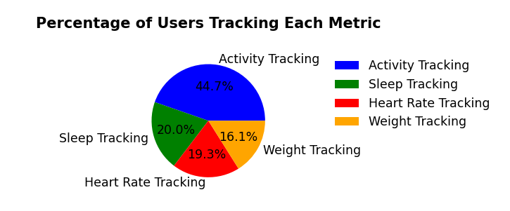
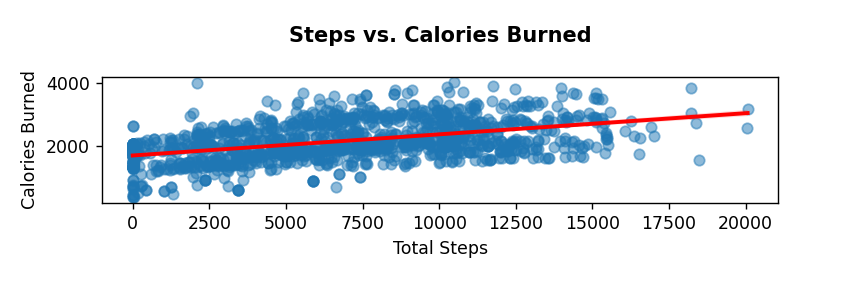
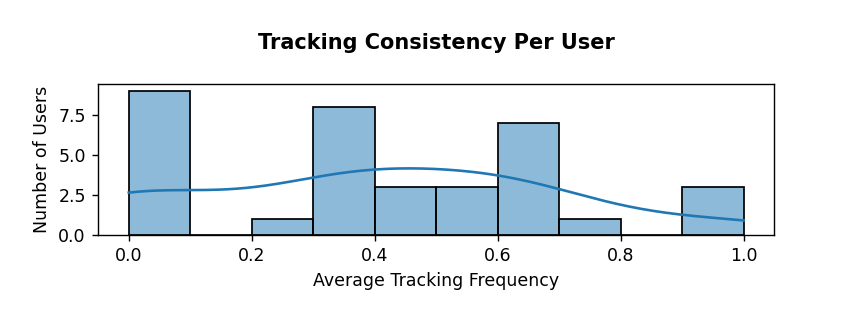

# Bellabeat Case Study - Full Analysis Report

## 📌 1. ASK Phase: Defining the Business Problem

### **Business Task:**

**How do consumers use non-Bellabeat smart devices, and how can these insights be applied to one of Bellabeat’s products to enhance its marketing strategy?**

Bellabeat specializes in **women’s health-focused smart devices** and seeks to **increase engagement with its app & membership services**.

### **Key Stakeholders:**

- **Urška Sršen** – Bellabeat’s co-founder and Chief Creative Officer
- **Sando Mur** – Mathematician and Bellabeat’s cofounder; key member of the Bellabeat executive team
- **Executive Team** – Urška Sršen, Sando Mur, and other members of the Bellabeat executive team
- **Bellabeat Marketing Analytics Team** – A team of data analysts responsible for collecting, analyzing, and reporting data that helps guide Bellabeat’s marketing strategy.

### **Key Objectives:**

✅ Identify tracking behaviors (activity, sleep, heart rate, weight).\
✅ Determine gaps in engagement (which metrics are underutilized?).\
✅ Recommend strategies to drive tracking engagement & Bellabeat Membership adoption.

---

## 📂 2. PREPARE Phase: Understanding the Data

### **Data Source:**

- Dataset comes from [`Kaggle`](https://www.kaggle.com/datasets/arashnic/fitbit/data), tracking **30 Fitbit users** over **two months (March-May 2016)**.
- Includes **activity, sleep, heart rate, and weight data**.

### **Data Limitations:**

⚠️ **Data is from 2016**, so behavior may have changed.\
⚠️ **Only two months of data**, making long-term engagement patterns unclear.\
⚠️ **Small sample size (30 users)**, limiting generalizability.

---

## 🔄 3. PROCESS Phase: Data Cleaning & Preparation

### **Key Cleaning Steps:**

✅ Standardized all date formats to **yyyy-mm-dd**.\
✅ Aggregated **minute/second-level data** to a **daily summary**.\
✅ Removed unnecessary columns & renamed inconsistent column names.\
✅ Handled missing values & flagged users who didn’t track certain metrics.\
✅ Removed extreme outliers (e.g., unrealistic step counts).\

📂 **Final Cleaned Data Includes:**

- **Activity Tracking:** Steps, distance, calories burned.
- **Sleep Tracking:** Total minutes asleep, total time in bed.
- **Heart Rate Tracking:** Average daily heart rate.
- **Weight Tracking:** Average daily weight & BMI.

---

## 📊 4. ANALYZE Phase: Identifying Key Insights

### **1️⃣ Activity Tracking Engagement**

📌 **Findings:**

- **Activity tracking is the most engaged metric**.
- Users tracking activity **burn more calories**.
- **Some users track steps but not calories**, indicating partial engagement.

### **2️⃣ Sleep Tracking Engagement**

📌 **Findings:**

- **55% of users do not track sleep**.
- Users tracking sleep have **more consistent activity levels**.
- **Engagement drop-offs suggest users may not wear their device overnight**.

### **3️⃣ Heart Rate Monitoring**

📌 **Findings:**

- **57% of users do not track heart rate**.
- Users who track heart rate tend to be **more engaged with other metrics**.
- Many users may be using devices without heart rate sensors.

### **4️⃣ Weight Tracking Engagement**

📌 **Findings:**

- Many users do not track weight **consistently**.
- Users tracking weight also **log more activity & sleep data**.

---

## 🎯 5. SHARE Phase: Presenting Insights with Visuals

📊 **Key Visualizations Used:**

1️⃣ **Pie Chart:** Percentage of users tracking each metric.

📌 **Purpose:** Identifies **engagement levels** in different health-tracking categories.

- **Activity tracking is the most common**, but **sleep and heart rate tracking are significantly lower**.
- **Weight tracking has the lowest engagement**, indicating users may not prioritize weight management or lack access to a smart scale.
- These **tracking gaps suggest opportunities** to encourage more comprehensive health monitoring.

2️⃣ **Scatter Plot:** Steps vs. Calories Burned.

📌 **Purpose:** Shows **correlation between activity levels and calorie expenditure**.

- A **clear positive correlation**—users with more steps **burn more calories**.
- **Some users have high step counts but lower-than-expected calorie burn**, possibly due to **data inconsistencies**.
- Reinforces the **importance of activity tracking for effective calorie management**.

3️⃣ **Histogram:** Tracking consistency per user.

📌 **Purpose:** Analyzes **how frequently users log data**.

- A **large number of users track inconsistently**, meaning they may not fully benefit from insights.
- **Some users track multiple metrics consistently**, making them **ideal candidates for Bellabeat Membership upsells**.
- Highlights a **potential engagement drop-off**, where users start tracking but do not maintain consistency.

---

## 🚀 6. ACT Phase: Marketing Recommendations

### **1️⃣ Encourage More Comprehensive Tracking Through the Bellabeat App**

📌 **Insight:** **55% of users don’t track sleep, and 57% don’t track heart rate** → A major opportunity to increase engagement.\
✅ **Strategy:** Bellabeat can use the **app to send reminders & challenges**, gamify tracking (badges, streaks), and introduce **weekly progress reports**.

### **2️⃣ Promote the Benefits of Sleep Tracking in the Bellabeat App**

📌 **Insight:** Sleep tracking is **significantly underutilized**.\
✅ **Strategy:** Bellabeat should **educate users** on the benefits of sleep tracking and send **in-app nudges** for users who track activity but not sleep.

### **3️⃣ Use the Bellabeat App to Convert Engaged Users to Membership**

📌 **Insight:** Users tracking multiple metrics may not know how to interpret their data.\
✅ **Strategy:** Offer a **free trial of Bellabeat Membership** to users who track **2+ health metrics consistently**, encouraging deeper engagement.

### **4️⃣ Data Limitations & Future Recommendations**

📌 **Insight:** The dataset is **outdated (2016)** and only covers **two months**.\
✅ **Strategy:** Bellabeat should collect **real-time & continuous data** to understand evolving user behavior.

---

## 📂 Project Deliverables

✅ **[README.md](../README.md)** – High-level project summary.  
✅ **This Report** – Detailed breakdown of all six analysis phases.

📢 **Final Recommendation:**
**Bellabeat should focus on increasing tracking engagement through its app and converting engaged users to Bellabeat Membership.**
